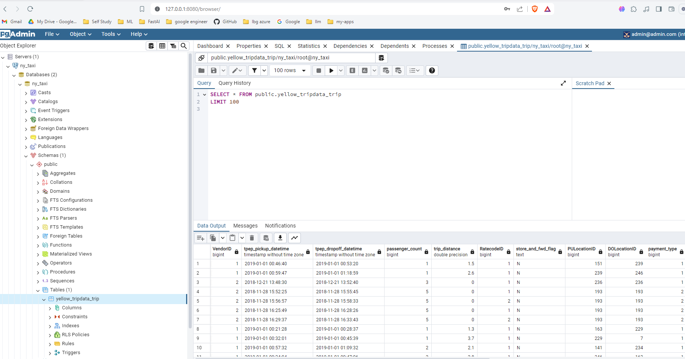

# docker-taxi-data-pipeline
using docker compose, postgress and other tools to create a data engineering pipeline.

# download data:

* $ mkdir data
* $ wget -P ./data https://github.com/DataTalksClub/nyc-tlc-data/releases/download/yellow/yellow_tripdata_2019-01.csv.gz
* $ gzip -d data/yellow_tripdata_2019-01.csv.gz

### DOCKER Commands used in experimentation. Ultimately the docker compose file can be used instead

## POSTGRESS DATABASE
# we can run the database first using docker for experimentation. Ultimately we will use the docker compose file
docker network create pg-network
docker run -it \
  -e POSTGRES_USER="root" \
  -e POSTGRES_PASSWORD="root" \
  -e POSTGRES_DB="ny_taxi" \
  -v $(pwd)/db/ny_taxi_postgres_data:/var/lib/postgresql/data \
  -p 5432:5432 \
  --network=pg-network \
  --name pg-database \
  postgres:13

# pgadmin on the same nework:
docker run -it \
  -e PGADMIN_DEFAULT_EMAIL="admin@admin.com" \
  -e PGADMIN_DEFAULT_PASSWORD="root" \
  -p 8080:80 \
  --network=pg-network \
  --name pgadmin-2 \
  dpage/pgadmin4

# view data in postgress admin server
First, Run the test_sql_connection.ipynb to ingest 100 rows into the server
Then view the data in the ui:
